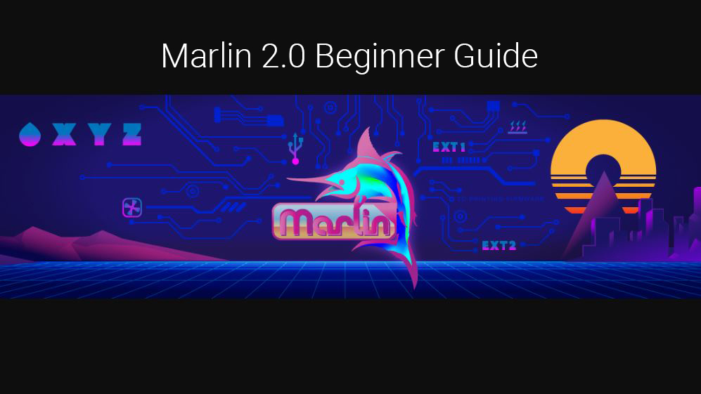
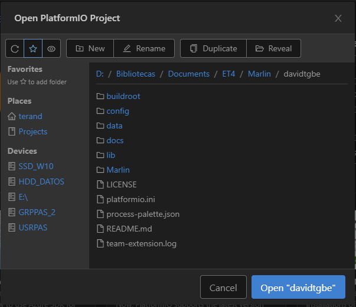
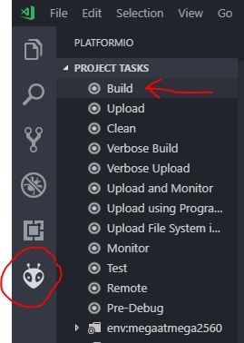
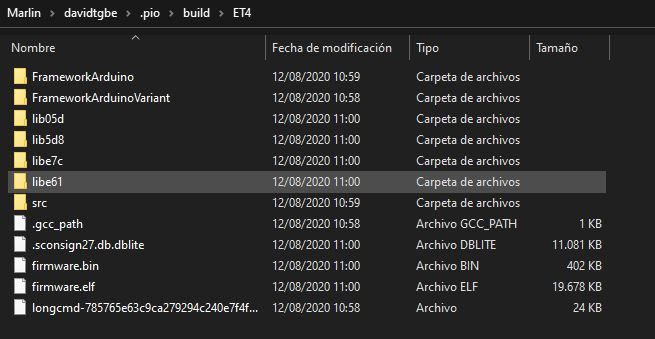

# Tutorial detallado para compilar Marlin

Requisitos previos

1.  Última versión del código fuente (descomprimida): [Haga clic
    aquí](https://github.com/davidtgbe/Marlin/archive/master.zip)

2.  VSCode para su SO/Arquitectura: [Haga clic aquí](https://code.visualstudio.com/download)

Eso es todo lo que se necesita. A continuación, veremos la instalación de PlatformIO en VSCode.  

## Instalación de Platform IO Extension con VSCode

Abra VSCode y haga clic en el ícono de Extensiones ubicado en la barra de
herramientas izquierda. 

A continuación, en el campo de búsqueda, escriba: **PlatformIO**

Busque la extensión PlatformIO IDE y haga clic en instalar.

Este proceso de instalación puede llevar algún tiempo
dependiendo de su máquina y sistema operativo.

Si todo va bien, puede que vea una notificación en la parte inferior derecha de su
IDE (entorno de desarrollo). Si es así, haga clic en "Recargar ahora".

¡Ya ha instalado PlatformIO para VSCode! 👏

## Abriendo Marlin en VSCode con PlatformIO

Si aún no lo ha hecho, descomprima los archivos descargados del 1er paso de los requisitos (el código fuente de marlin) en su directorio
preferido.

Ahora, con VSCode abierto, haga clic en el ícono PlatformIO en la barra de
herramientas derecha y luego abra la carpeta marlin que acaba de descomprimir en
su directorio preferido.

Abra la carpeta de nivel superior marlin y asegúrese de que vea el archivo
platformio.ini. Luego haga clic en "abrir".

Bien, ahora está listo para comenzar a configurar y compilar su compilación.

## Archivos de configuración

Para ajustar Marlin a las especificaciones de su impresora 3D, deberá editar
el archivo Configuration.h y, si necesita una configuración avanzada, el archivo
Configuration_adv.h. 

También puede usar el archivo [EasyConfig.h](/Marlin/EasyConfig.h), que simplifica mucho el proceso. Siga las instrucciones que se detallan el los comentarios de este archivo.

Como se dice en las instrucciones principales, la configuración por defecto está en español y es para ua ET4 con placa silenciosa sin ninguna modificación adicional.

En estos archivos podemos encontrar todos los parámetros necesarios para ajustar Marlin a nuestro hardware. Por ejemplo, tipo de drivers, volumen de impresión, ajustes de la sonda de autonivelado, idioma, etc.

Si nunca antes ha ajustado esta configuración y desea aprender cómo puede hacerlo, puede
seguir el tutorial de Marlin 2.0.

Existen también programas que pueden asistirle para llevar a cabo una configuración exitosa.

https://github.com/akaJes/marlin-config/releases

También dispone de varios tutoriales en la web, como por ejemplo:

<https://3dwork.io/configurar-marlin-2-0-x-desde-cero/>

## Compilar

Es hora de probar la compilación y ver si se compila correctamente.

Para ejecutar una compilación, haga clic en el icono de la extensión Plataform.io y luego
haga clic en el botón de compilar. Tenga en cuenta que también
hay iconos en la parte inferior de la barra de herramientas que puede utilizar.

Esto ejecutará el comando de compilación y comenzará a compilar marlin. Verá una
ventana de terminal abierta y el progreso de la compilación. Si todo va bien,
verá un mensaje de éxito. Si algo falla, asegúrese de tener la
configuración correcta o busque en Google el error.

Puede encontrar el firmware compilado en "carpeta_raiz_proyecto/.pio/build/et4/"

## Flashear el firmware

Hay varios tutoriales disponibles para distintos programadores xej: [stlink](https://www.cnx-software.com/2020/02/04/how-to-recover-from-a-bad-firmware-upgrade-on-anet-et4-3d-printer/)/[j-link](https://danielabalo.wordpress.com/flasear-anet-et4/) flashers. 

En el grupo de ET4 España de Telegram nuestro compañero @Macugo también ha hecho uno.

Lo único a tener en cuenta y que puede diferir del fin de los manuales expuestos previamente es la dirección de memoria en la cual hay que flashear. **Es imprescindible flashear en la 0x08000000**.

## Agradecimientos

Este tutorial está basado en el tutorial de 3dwork.io que podéis encontrar en:

https://3daddict.com/marlin-2-0-beginner-guide-for-3d-printer-firmware/
